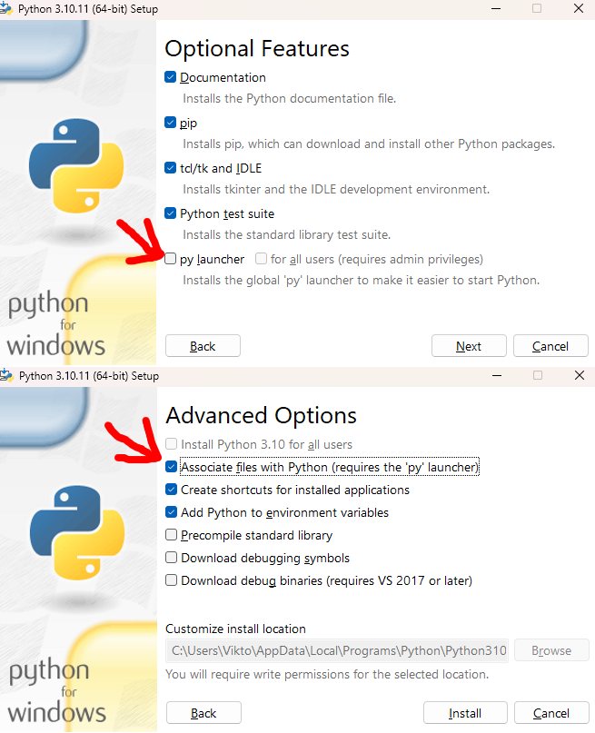

# ComfyUI-Intel-Installer-Script
 
This is a script to conveniently install ComfyUI and relevant Intel requirements, workarounds and others.

In order to run this script, you will need to have installed [Python](https://www.python.org/downloads/windows/) and its py launcher:

 

This way you can double click the script to run it. If you have not done this, you can relaunch the installer, choose modify, and change that. Alternatively, you can also
open a command prompt in the same folder as the script (shift+right click folder background > open command prompt/powershell window here) and then type in `python .\Setup_ComfyUI_Intel.py`

Additionally, you will need [git](https://git-scm.com/download/win) and [miniconda](https://docs.anaconda.com/miniconda/#latest-miniconda-installer-links) or some other form of anaconda installed.

You can download the script from above, or from [here](https://raw.githubusercontent.com/a-One-Fan/ComfyUI-Intel-Installer-Script/refs/heads/one/Setup_ComfyUI_Intel.py), then right clicking and choosing "save as".
