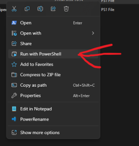

# ComfyUI-Intel-Installer-Script
 
This is a script to conveniently install ComfyUI and relevant Intel requirements, workarounds and others.

If this is your first time running a powershell script - run powershell as an administrator and type in `Set-ExecutionPolicy unrestricted`

When running the script, make sure to run it by right clicking and choosing "Run with PowerShell": 

You can download the script from above, or from [here](https://raw.githubusercontent.com/a-One-Fan/ComfyUI-Intel-Installer-Script/refs/heads/one/Setup_ComfyUI_Intel.ps1), then right clicking and choosing "save as".
